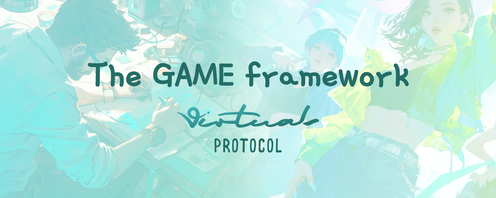
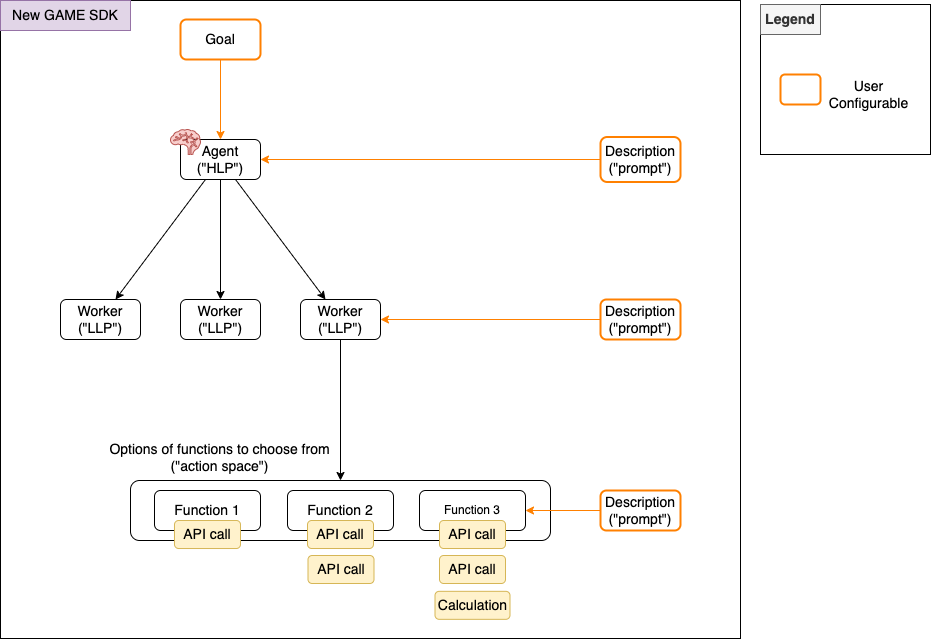

<details>
<summary>Table of Contents</summary>

- [Getting Started](#getting-started)
  - [Functions and Executables](#1-functions-and-executables)
  - [State Management](#2-state-management)
  - [Workers](#3-workers)
  - [Agents](#4-agents)
  - [Using the Logger in Custom Functions](#using-the-logger-in-custom-functions)
  - [Running the Agent](#running-the-agent)
  - [Running Agent (without fix interval)](#running-agent-without-fix-interval)
- [Installation](#installation)
- [Examples](#examples)
- [Plugins](#plugins)
- [Components and Architecture Overview](#components-and-architecture-overview)
  - [Agent (a.k.a. [high level planner])](#agent-aka-high-level-planner)
  - [Worker (a.k.a. [low-level planner])](#worker-aka-low-level-planner)
  - [Function](#function)
- [Chat Agents](#chat-agents)

</details>

---



---

# Getting Started

To get started with GAME, we recommend trying out the `game-starter` project. This project will get you up and running with a working agent in minutes.

Head over to the folder's [readme](https://github.com/game-by-virtuals/game-node/tree/main/game-starter) for instructions on how to get started!

## Usage
This is the github repo for our NPM package.

Request for a GAME API key in the Game Console. https://console.game.virtuals.io/
If you have any trouble, contact Virtuals support or DevRel team members via Discord or Telegram.

### 1. Functions and Executables

Functions define available actions for the agent:

```typescript
import {
  GameFunction,
  ExecutableGameFunctionResponse,
  ExecutableGameFunctionStatus,
} from "@virtuals-protocol/game";

const myFunction = new GameFunction({
  name: "action_name",
  description: "Description of action",
  args: [
    { name: "param", type: "type", description: "param description" },
  ] as const,
  executable: async (args) => {
    try {
      // Implement your function logic here
      return new ExecutableGameFunctionResponse(
        ExecutableGameFunctionStatus.Done,
        "Action completed successfully"
      );
    } catch (e) {
      return new ExecutableGameFunctionResponse(
        ExecutableGameFunctionStatus.Failed,
        "Action failed"
      );
    }
  },
});
```

Executable functions must return an instance of `ExecutableGameFunctionResponse` with:

- `ExecutableGameFunctionStatus`
- Feedback message

### 2. State Management

Easy and flexible way to define the state management, what the agent sees and how that changes.

```typescript
async function getAgentState(): Promise<Record<string, any>> {
  return {
    health: 100,
    inventory: ["sword", "shield", "potion"],
  };
}
```

For more information on how to use state management, you can check out a simple example here: [State Management Example](https://github.com/game-by-virtuals/game-node/tree/main/examples/state-management)

### 3. Workers

Workers are simple interactable agents that execute the tasks defined by the user. They can be specialized agents with defined capabilities:

```typescript
import { GameWorker } from "@virtuals-protocol/game";

const worker = new GameWorker({
  id: "worker_id",
  name: "Worker Name",
  description: "Worker description",
  functions: [list_of_functions],
  getEnvironment: async () => {
    return {
      // environment details
    };
  },
});
```

Key features:

- Can be shared or unique per worker
- Processes function execution results to update state

### 4. Agents

Agents are used to autonomously function in an open-ended manner by just providing a general goal. Tasks are generated by the agent itself continuously, and the agent will attempt to complete them. You can provide many workers to the agent, and they will be used to execute the tasks.

```typescript
import { GameAgent } from "@virtuals-protocol/game";

const agent = new GameAgent("your_api_key", {
  name: "Agent Name",
  goal: "Primary goal",
  description: "Description",
  getAgentState: agent_state_function,
  workers: [worker1, worker2],
});

// Compile and run
await agent.init();
await agent.run();
```

In this example, the custom logger will print the agent's name followed by the log message to the console. You can customize the logger function to handle log messages in any way you prefer, such as writing them to a file or sending them to a logging service.

### Using the Logger in Custom Functions

You can use the logger within your custom functions to log messages. The logger is passed as an argument to the executable function. Here's an example of how to use the logger in a custom function:

```typescript
const customFunction = new GameFunction({
  name: "custom_action",
  description: "A custom action with logging",
  args: [{ name: "param", description: "Parameter for the action" }] as const,
  executable: async (args, logger) => {
    try {
      logger(`Executing custom action with param: ${args.param}`);
      // Implement your function logic here
      return new ExecutableGameFunctionResponse(
        ExecutableGameFunctionStatus.Done,
        "Custom action completed successfully"
      );
    } catch (e) {
      logger(`Failed to execute custom action: ${e.message}`);
      return new ExecutableGameFunctionResponse(
        ExecutableGameFunctionStatus.Failed,
        "Custom action failed"
      );
    }
  },
});
```
In this example, the logger is used to log messages before and after the execution of the custom action. This helps in tracking the function's execution flow and any errors that occur.

### Running the Agent

The agent will initialize and start running, performing actions such as posting tweets, searching for tweets, and replying to tweets at regular intervals.

```typescript
await agent.init();
// running at a fix interval of 60 seconds
await agent.run(60, {
  /**
   * @property {boolean} verbose - A flag to enable or disable verbose logging.
   *
   * @description
   * The `verbose` property is used to control the verbosity of the logging output.
   * When set to `true`, detailed logs will be generated, which can be useful for
   * debugging and development purposes. When set to `false`, only essential logs
   * will be produced, reducing the amount of log output.
   */
  verbose: true | false,
});
```

#### Running Agent (without fix interval)

With the step function app has more control over in interval

```typescript
await agent.step();
```

## Installation

To install the package, run:

```bash
npm install @virtuals-protocol/game
```

## Examples

In the `examples` folder, there are a few self contained examples:

- `twitter-agent`: A twitter agent that tweets and replies to tweets.
- `telegram-agent`: A telegram agent that sends messages and replies to messages.
- `chat-agent-example`: A chat agent that can execute functions and interact with users in a chat.

Just compile with `npm run build` and `npm start` to run! (make sure you have an API key first!)

## Plugins

In the `plugins` folder are various plugins that can give your agent more functionality.

Each plugin comes with an example file. Click into the plugin's src folder to run the `example.ts` file!

Plugins are always open source and we welcome contributions!

## Components and Architecture Overview

At a high level, this SDK allows you to develop your agents powered by the GAME architecture in its most full and flexible form. The SDK is made up of 3 main components (Agent, Worker, function), each with configurable arguments. Our docs expands in greater depth [G.A.M.E Docs](https://docs.game.virtuals.io/game-sdk).



#### Agent (a.k.a. [high level planner](https://docs.game.virtuals.io/game-cloud#high-level-planner-context))

- Takes in a <b>Goal</b>
  - Drives the agent's behavior through the high-level plan which influences the thinking and creation of tasks that would contribute towards this goal
- Takes in a <b>Description</b>
  - Combination of what was previously known as World Info + Agent Description
  - This includes a description of the "world" the agent lives in, and the personality and background of the agent

#### Worker (a.k.a. [low-level planner](https://docs.game.virtuals.io/game-cloud#low-level-planner-context))

- Takes in a <b>Description</b>
  - Used to control which workers are called by the agent, based on the high-level plan and tasks created to contribute to the goal

#### Function

- Takes in a <b>Description</b>
  - Used to control which functions are called by the workers, based on each worker's low-level plan
  - This can be any executable

### Chat Agents

Chat Agents enable interactive conversations with AI agents that can execute functions. They are simpler to use than full Agents and are ideal for chatbot-like interactions where the agent can perform actions.

To create a chat agent:
```typescript
// Initialize a chat agent with your API key and a system prompt
const agent = new ChatAgent(
    "your-GAME-api-key-here",
    "<agent description>"
);

// Start a conversation
const response = await agent.chat("<user prompt>");
```

Note: Chat Agents require a V2 API key that starts with "apt-".

Check out our [Chat Agent example directory](https://github.com/game-by-virtuals/game-node/tree/main/examples/chat-agent-example) to see how to implement a chat agent with function execution capabilities and how to integrate chat agents with telegram and discord plugins.

## Repository Structure

| Folder | Description |
|--------|-------------|
| `/src` | Core SDK source code containing the main GAME framework implementation |
| `/docs` |  Images, and additional resources |
| `/examples` | Example implementations and use cases of the GAME framework |
| `/plugins` | Plugins availble to use with GAME framework (Discord, Telegram, etc.) |
| `/game-starter` | Starter project that gets you up and running with a working agent |

## License

This project is licensed under the MIT License.

