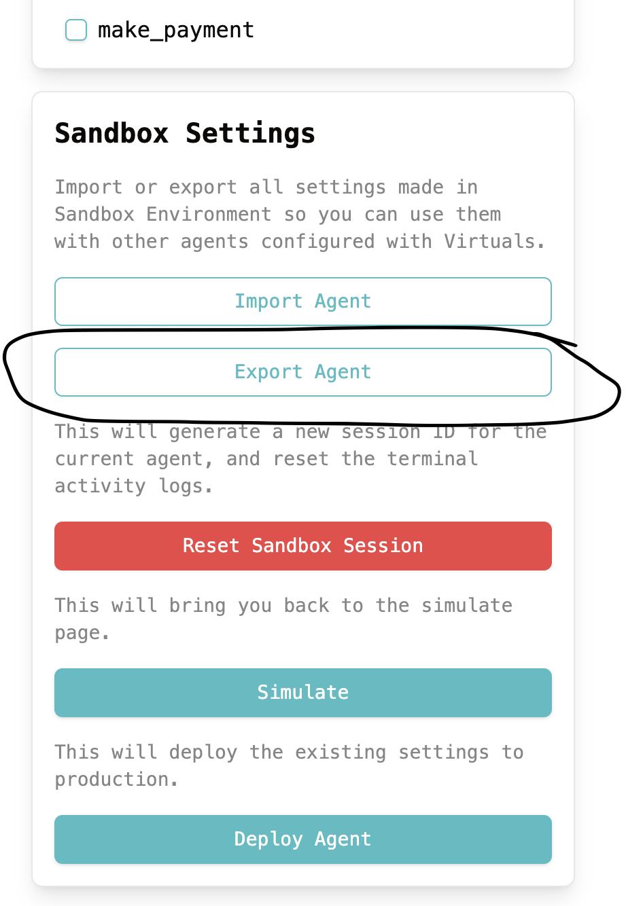

# Cloud-to-SDK Converter Tool

This tool helps you convert GAME cloud configuration JSON files into SDK-compatible TypeScript files.

## Important Notes

*Note: This tool provides a starting point for code generation but has some limitations:*

* Always verify generated code before production use
* Some edge cases might not automatically handled:
  * Complex function implementations
  * Special character handling in descriptions/hints
  * Some functions might have been abstracted by GAME Cloud and is not generated in the json file, in which case you will need to implement them manually
* Manual review and modification may be needed

## Overview

If you have an existing GAME configuration JSON file from the cloud platform, you can use this tool to automatically generate the necessary TypeScript files for SDK integration.

## Usage

1. Go to your GAME Cloud page, and click on the "Export Agent" button to download the JSON file

2. Place your GAME cloud JSON file in the tools/cloud-to-sdk directory
3. Run the conversion tool with the following command:
   npm run cloud-to-sdk -- <your_json_file>

This will create an `output` directory containing:
- agent.ts - Contains the GameAgent configuration
- worker.ts - Contains worker definitions
- functions.ts - Contains function implementations

*note: the functions generated are currently incomplete, they just contain function name, description and a boilerplate implementation, you will need to implement them.

